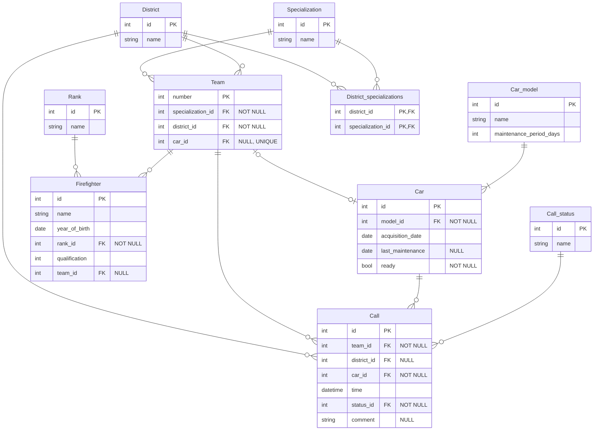

# Система управления пожарной частью (Fire Department)

Бэкенд-приложение для управления пожарными, командами, специализациями, автомобилями, районами и вызовами. Поддерживает REST API, интерактивный CLI и миграции базы данных.

## 1. Требования к хранимым данным

Система управляет следующими ключевыми сущностями:

- **Firefighter (Пожарный):** Имя, дата рождения, звание, квалификация, принадлежность к команде (опционально).
- **Team (Команда):** Номер, специализация, район, закреплённый автомобиль (опционально, уникально).
- **District (Район):** Название района обслуживания.
- **Car (Автомобиль):** Модель, дата приобретения, дата последнего ТО, готовность.
- **Call (Вызов):** Команда, автомобиль, район (опционально), время, статус, комментарий.

**Основные ограничения:**

- Один автомобиль может быть закреплён только за одной командой одновременно (уникальность `car_id` в таблице `Team`).
- Пожарный может не принадлежать ни к одной команде (необязательное поле `team_id`).
- Вызов обязательно содержит ссылки на команду, автомобиль и статус; район может быть не указан.
- Период технического обслуживания хранится на уровне модели автомобиля, а не конкретной машины (нормализация).

## 2. Архитектура БД

### ER-диаграмма



### Анализ нормализации

Схема базы данных удовлетворяет требованиям нормальной формы Бойса-Кодда.

Обоснование:
- Все таблицы‑справочники (Rank, Specialization, District, Car_model, Call_status) содержат только один потенциальный ключ — первичный, и все неключевые атрибуты полностью от него зависят.
- Все неключевые атрибуты Car зависят только от первичного ключа id.
- В таблице Team поле car_id уникально, но оно может быть NULL, что не создаёт дополнительной функциональной зависимости.
- Все связи многие‑ко‑многим (District_specializations) разложены на две связи 1:N, каждая из которых соответствует BCNF.

В каждой таблице любой детерминант является суперключом, что гарантирует форму Бойса-Кодда. 

# 3. Архитектура приложения

Приложение разделено на следующие слои:
- Слой обработчиков (handlers): Приём HTTP-запросов, валидация входных данных, формирование ответов. Используется роутер chi.
- Слой репозиториев (repository): Интерфейсы для доступа к данным (CRUD и специфичные запросы). Реализации находятся в пакете postgres и используют pgxpool.
- Слой моделей (models): Структуры, отображающие таблицы БД, с тегами для JSON и БД.
- Интерактивный CLI: Альтернативный способ взаимодействия с системой напрямую через терминал. Позволяет выполнять все CRUD-операции без HTTP-запросов.

### Таблица: эндпоинты REST API
| Метод  | URL                                             | Описание                                      |
|--------|-------------------------------------------------|-----------------------------------------------|
| POST   | /api/ranks                                      | Создать звание                                |
| GET    | /api/ranks                                      | Получить все звания                           |
| GET    | /api/ranks/{id}                                 | Получить звание по ID                         |
| PUT    | /api/ranks/{id}                                 | Обновить звание                               |
| DELETE | /api/ranks/{id}                                 | Удалить звание                                |
| POST   | /api/specializations                            | Создать специализацию                         |
| GET    | /api/specializations                            | Получить все специализации                    |
| GET    | /api/specializations/{id}                       | Получить специализацию по ID                  |
| PUT    | /api/specializations/{id}                       | Обновить специализацию                        |
| DELETE | /api/specializations/{id}                       | Удалить специализацию                         |
| POST   | /api/districts                                  | Создать район                                 |
| GET    | /api/districts                                  | Получить все районы                           |
| GET    | /api/districts/{id}                             | Получить район по ID                          |
| PUT    | /api/districts/{id}                             | Обновить район                                |
| DELETE | /api/districts/{id}                             | Удалить район                                 |
| POST   | /api/districts/{id}/specializations/{specId}    | Добавить специализацию району                 |
| DELETE | /api/districts/{id}/specializations/{specId}    | Удалить специализацию у района                |
| GET    | /api/districts/{id}/specializations             | Получить специализации района                 |
| POST   | /api/car-models                                 | Создать модель автомобиля                     |
| GET    | /api/car-models                                 | Получить все модели автомобилей               |
| GET    | /api/car-models/{id}                            | Получить модель автомобиля по ID              |
| PUT    | /api/car-models/{id}                            | Обновить модель автомобиля                    |
| DELETE | /api/car-models/{id}                            | Удалить модель автомобиля                     |
| POST   | /api/call-statuses                              | Создать статус вызова                         |
| GET    | /api/call-statuses                              | Получить все статусы вызовов                  |
| GET    | /api/call-statuses/{id}                         | Получить статус вызова по ID                  |
| PUT    | /api/call-statuses/{id}                         | Обновить статус вызова                        |
| DELETE | /api/call-statuses/{id}                         | Удалить статус вызова                         |
| POST   | /api/cars                                       | Создать автомобиль                            |
| GET    | /api/cars                                       | Получить все автомобили (фильтр ?model=id)    |
| GET    | /api/cars/{id}                                  | Получить автомобиль по ID                     |
| PUT    | /api/cars/{id}                                  | Обновить автомобиль                           |
| DELETE | /api/cars/{id}                                  | Удалить автомобиль                            |
| POST   | /api/teams                                      | Создать команду                               |
| GET    | /api/teams                                      | Получить все команды (фильтры ?district=, ?specialization=) |
| GET    | /api/teams/{number}                             | Получить команду по номеру                    |
| PUT    | /api/teams/{number}                             | Обновить команду                              |
| DELETE | /api/teams/{number}                             | Удалить команду                               |
| POST   | /api/firefighters                               | Создать пожарного                             |
| GET    | /api/firefighters                               | Получить всех пожарных (фильтр ?team=)        |
| GET    | /api/firefighters/{id}                          | Получить пожарного по ID                      |
| PUT    | /api/firefighters/{id}                          | Обновить пожарного                            |
| DELETE | /api/firefighters/{id}                          | Удалить пожарного                             |
| POST   | /api/calls                                      | Создать вызов                                 |
| GET    | /api/calls                                      | Получить все вызовы (фильтры ?team=, ?car=, ?district=, ?status=) |
| GET    | /api/calls/{id}                                 | Получить вызов по ID                          |
| PUT    | /api/calls/{id}                                 | Обновить вызов                                |
| DELETE | /api/calls/{id}                                 | Удалить вызов                                 |

### Технологический стек:
- Go 1.26.2
- PostgreSQL 18
- Драйвер pgx/v5
- HTTP-роутер chi/v5
- Миграции golang-migrate/v4
- Модульные тесты testify/mock

# 4. Тестирование

Для проверки корректности HTTP-обработчиков используются модульные тесты с изоляцией от базы данных через моки репозиториев.
- testify/mock: Создание мок-объектов, реализующих интерфейсы репозиториев.
- httptest: Имитация HTTP-запросов и проверка ответов.
- chi роутер: Тестирование маршрутов в изолированном окружении.

Тестирование запускается из корня проекта:
```
go test -v ./tests/handler_test
```
# 5. Запуск

Запуск производится в двух режимах: сервер (по умолчанию) и интерактивный cli:
```
go run .
or
go run . cli
```
