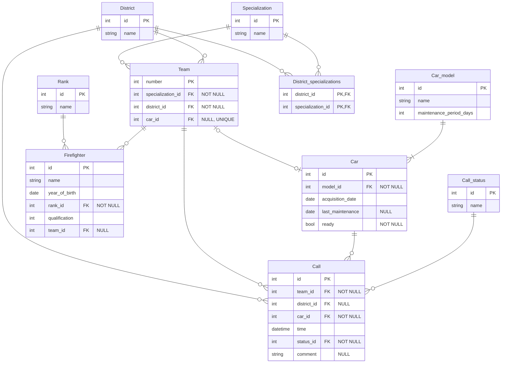

# Система управления пожарной частью (Fire Department)

Бэкенд-приложение для управления пожарными, командами, специализациями, автомобилями, районами и вызовами. Поддерживает REST API, интерактивный CLI и миграции базы данных.

## 1. Требования к хранимым данным

Система управляет следующими ключевыми сущностями:

- **Firefighter (Пожарный):** Имя, дата рождения, звание, квалификация, принадлежность к команде (опционально).
- **Team (Команда):** Номер, специализация, район, закреплённый автомобиль (опционально, уникально).
- **District (Район):** Название района обслуживания.
- **Car (Автомобиль):** Модель, дата приобретения, дата последнего ТО, готовность.
- **Call (Вызов):** Команда, автомобиль, район (опционально), время, статус, комментарий.

**Основные ограничения:**

- Один автомобиль может быть закреплён только за одной командой одновременно (уникальность `car_id` в таблице `Team`).
- Пожарный может не принадлежать ни к одной команде (необязательное поле `team_id`).
- Вызов обязательно содержит ссылки на команду, автомобиль и статус; район может быть не указан.
- Период технического обслуживания хранится на уровне модели автомобиля, а не конкретной машины (нормализация).

## 2. Архитектура БД

### ER-диаграмма

### Анализ нормализации

Схема базы данных удовлетворяет требованиям нормальной формы Бойса-Кодда.

Обоснование:
- Все таблицы‑справочники (Rank, Specialization, District, Car_model, Call_status) содержат только один потенциальный ключ — первичный, и все неключевые атрибуты полностью от него зависят.
- Все неключевые атрибуты Car зависят только от первичного ключа id.
- В таблице Team поле car_id уникально, но оно может быть NULL, что не создаёт дополнительной функциональной зависимости.
- Все связи многие‑ко‑многим (District_specializations) разложены на две связи 1:N, каждая из которых соответствует BCNF.

В каждой таблице любой детерминант является суперключом, что гарантирует форму Бойса-Кодда. 

# 3. Архитектура приложения

Приложение разделено на следующие слои:
- Слой обработчиков (handlers): Приём HTTP-запросов, валидация входных данных, формирование ответов. Используется роутер chi.
- Слой репозиториев (repository): Интерфейсы для доступа к данным (CRUD и специфичные запросы). Реализации находятся в пакете postgres и используют pgxpool.
- Слой моделей (models): Структуры, отображающие таблицы БД, с тегами для JSON и БД.
- Интерактивный CLI: Альтернативный способ взаимодействия с системой напрямую через терминал. Позволяет выполнять все CRUD-операции без HTTP-запросов.

Технологический стек:
- Go 1.26.2
- PostgreSQL 18
- Драйвер pgx/v5
- HTTP-роутер chi/v5
- Миграции golang-migrate/v4
- Модульные тесты testify/mock

# 4. Тестирование

Для проверки корректности HTTP-обработчиков используются модульные тесты с изоляцией от базы данных через моки репозиториев.
- testify/mock: Создание мок-объектов, реализующих интерфейсы репозиториев.
- httptest: Имитация HTTP-запросов и проверка ответов.
- chi роутер: Тестирование маршрутов в изолированном окружении.
